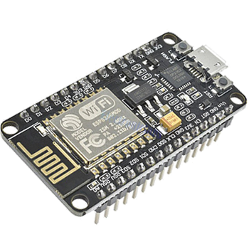
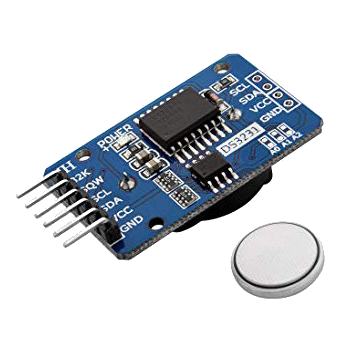
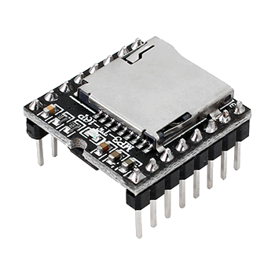
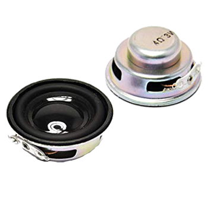
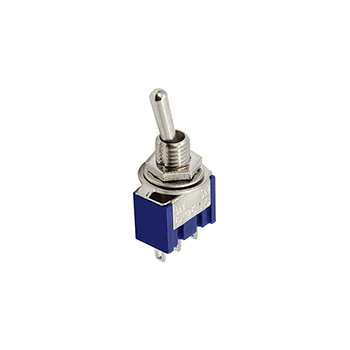
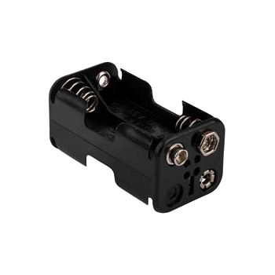
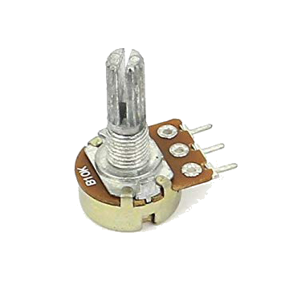

#Components

Components needed for a single caller.
The cost for a single component is referred to batches of 3-5 items (10 items for the switch)

-
   

| Item | Description          | cost/item |
| ---------- | ---------------------- | ---------: |
|  | [ESP8266/12E Microcontroller](https://www.amazon.it/gp/product/B0754HWZSQ) https://www.amazon.it/gp/product/B0754HWZSQ | 7,50€ |
|  | [DS3231 RTC Module](https://www.amazon.it/gp/product/B076GP5B94)  https://www.amazon.it/gp/product/B076GP5B94| 3,00€ |
|  | [DFPlayer Mini](https://www.amazon.it/gp/product/B07911V1NL) https://www.amazon.it/gp/product/B07911V1NL | 3,50€ |
|  | [3W/4Ohm Speakers](https://www.amazon.it/gp/product/B07LGHZD9R)  https://www.amazon.it/gp/product/B07LGHZD9R| 4,50€ |
|  | [2-way switch](https://www.amazon.it/gp/product/B077D9FRGL)  https://www.amazon.it/gp/product/B077D9FRGL | 0,80€ |
|  | [Battery holder](https://www.amazon.it/dp/B01FYUUPGE)  https://www.amazon.it/dp/B01FYUUPGE | 2,50€ |
| | Cables, wires, 10KOhm trimmer, battery snap, PCB | 5,0€ | 
| | Enclosure Box 120x80x50 (IP56) | 3,20€ |
| | Total cost | **30,00€** |

